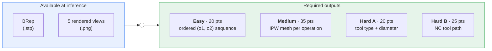
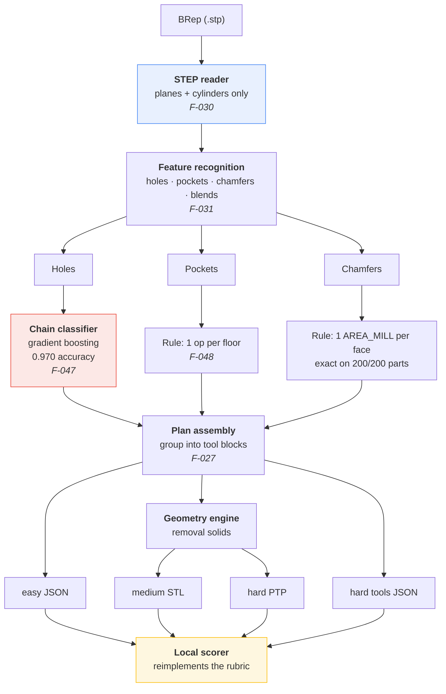
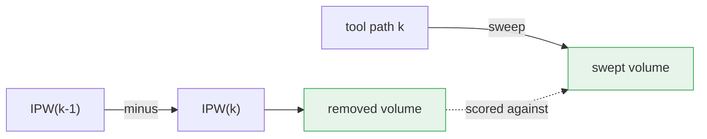
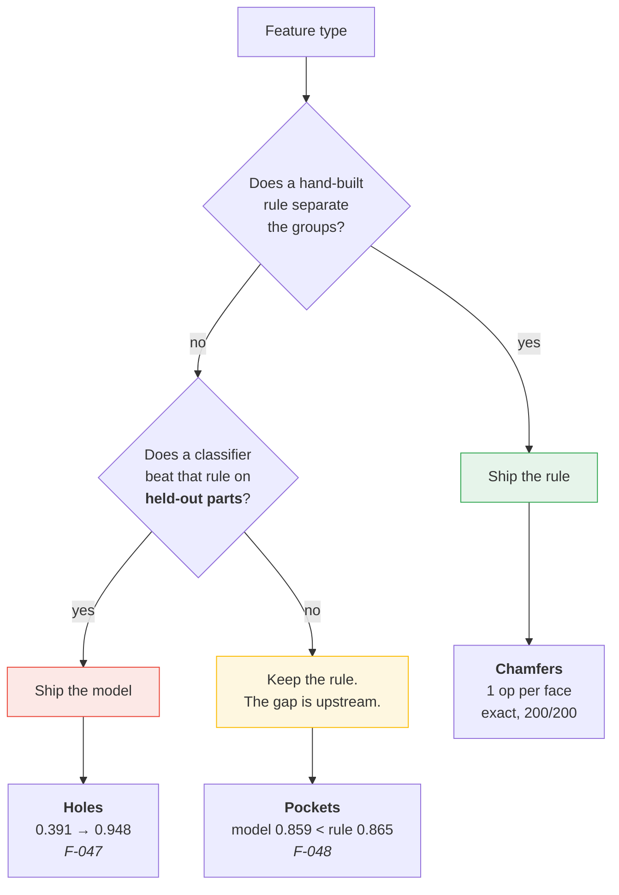
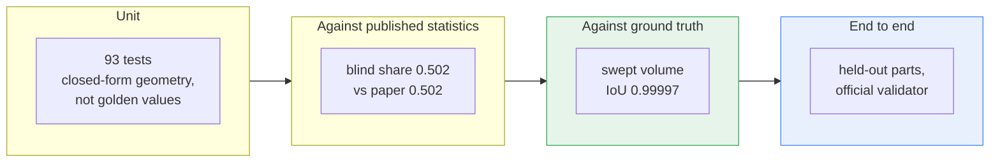
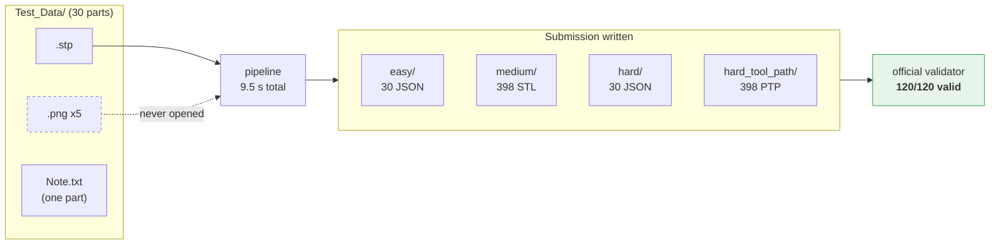
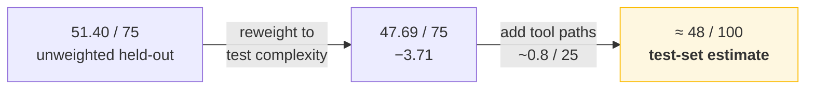
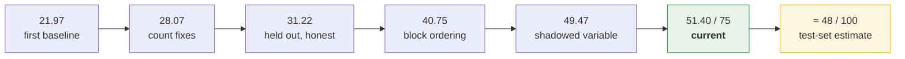

# Methodology: ASME CIE 2026 Hackathon, Problem 1

How the solution is built and, more importantly, **why it is built that way**.
Every claim here is backed by a measurement recorded in [FINDINGS.md](FINDINGS.md);
finding IDs are cited inline so nothing has to be taken on trust.

> Working note, gitignored like the rest of `docs/`. This is the seed of the
> public Round 2 methods write-up, not the write-up itself.

---

## 1. The problem

Convert a raw rectangular block into a finished part by removing material, and
predict the whole plan from the design geometry alone.

Ground truth comes from Siemens NX applying **deterministic rules**, so the task
is really *rule recovery* from 10,000 worked examples, 91,702 operations in all.

---

## 2. Architecture

---

## 3. The governing decision: measure before building

The first thing built was **not** a predictor but a local reimplementation of the
entire rubric: Levenshtein/F1, volumetric IoU, swept-volume comparison. Nothing
could be improved until it could be scored.

That ordering paid for itself immediately. Reimplementing the scorer is what
surfaced the facts that shaped everything after it:

| Finding | Consequence |
|---|---|
| `o1` is fully determined by `o2` (F-001) | Label space 21 → 7 before any model existed |
| `OTHER` validates but never occurs (F-002) | An attractive fallback that can only lose points |
| Medium IoU ≈ operation-count ratio, r = 0.999 (F-037) | Reprioritised the whole project |
| Rubric sub-tables don't sum to their budgets (F-006) | Logged for the organizers rather than guessed at |

---

## 4. Three structural insights

### 4.1 Medium and Hard-path are the same problem (F-005)

The rubric scores a tool path by comparing its swept volume against the boolean
difference of consecutive IPWs. That is an identity:

So **60 of the 100 points share one geometry engine** rather than needing two.

### 4.2 Sequences are tool-blocked, not sorted (F-027)

Three hypotheses tested across all 10,000 parts:

| Hypothesis | Holds |
|---|---:|
| chamfers → pockets → holes | 54.45% |
| sorted by NX `Order Group` | 27.93% |
| **each tool in one contiguous block** | **70.55%** |

Cross-check: `tool_changes == blocks − 1` for **10,000 of 10,000 parts**. The plan
is tool-change minimisation under precedence constraints.

Because 97.65% of those blocks carry a single label (F-029), the easy tier's real
target is only **~4.5 (label, count) pairs**, not a sequence of up to 38 tokens.

### 4.3 Every cutting tool is convex (F-014)

For a convex body translated along a segment, the swept region is *exactly* the
convex hull of the body at both endpoints. So each move is computed exactly, not
sampled, 272 hulls instead of ~4,944 tool placements on a real operation.

---

## 5. Rules or learning? Decided per feature, by measurement

This is the central methodological point. The three feature types reached three
*different* answers, each on evidence:

- **Holes**. Hand rules scored 0.374; a gradient-boosted classifier on the same
  features scored **0.970** on 6,757 holes from 2,519 unseen parts, cutting
  operation-count error nearly 17× (0.674 → 0.040). The rules scored **0.000** on
  the single most common chain.
- **Pockets**. The same recipe scored **0.859 against the trivial rule's 0.865**.
  The information is not in the recognised geometry. The training script's guard
  refused to save it.
- **Chamfers**. A one-line rule is already exact on 200/200 parts. Nothing to learn.

---

## 6. Discipline: what was rejected, and why

Six changes were implemented, measured, and **reverted**. They are documented at
the point of decision in the code so they are not re-derived.

| Change | Aggregate effect | Score effect | Verdict |
|---|---|---|---|
| Split wide-cornered pockets | net error −0.515 → **−0.015** | parts wrong 69 → **86** | reverted |
| `SPOT→DRILL→HOLE_MILLING` for all mid-band bores | closes a real 4.5% chain | medium 13.33 → **12.08** | reverted |
| Chamfer path along the edge | plausible tool motion | paths 1.72 → **1.25** | reverted |
| Rounded pocket corners | more faithful geometry | IoU 0.8856 → **0.8857** | kept, ~nil |
| Stricter floor merging | more defensible rule | **exactly neutral** | kept, ~nil |
| Pocket count classifier | none | worse than "always 1" | not shipped |

The recurring failure mode is worth naming: **a real but weak signal, applied to
every member of a group, fixes the population mean and breaks individual parts.**
Since medium IoU scores each part independently (F-037), matching a marginal
without separating the groups is a net loss.

Two of my own findings were also **refuted by later measurement** and are marked
superseded in place rather than deleted (F-032 on hole milling, F-036 on cut
policy), because the reasoning error is the instructive part.

---

## 7. Validation

Two rules that caught real defects:

1. **Test against closed forms, not golden values.** A cylinder dragged a distance
   *L* must sweep `πr²h + 2rLh`. A test pinning current behaviour would have let a
   systematic error through.
2. **Split by part, never by hole.** Holes on one part share a block, a feature mix
   and a tool set. And in-sample scoring is quoted as such: parts 1–12 give 36.85,
   held-out parts give **31.22**, a 5.6-point optimism gap.

Stratified validation is what exposed three silent NC-parsing bugs (F-023) that
unit tests on synthetic paths never could: a `G4` dwell read as motion (6.4×
overcut), `G73` missing from the cycle set (33% of operations swept *nothing*),
and unsupported R-format arcs.

---

## 8. The released test set

Thirty parts, boundary representation and renders only. **No ground truth**, so
we cannot score ourselves on it. The organizers hold the labels.

**Two deliberate traps, both handled.**

`featured_part_22222` carries a note saying to infer it *without any images*, and
its folder contains none. We read only the boundary representation, so it
processed like every other part. It is also out of distribution: 16 holes against
a corpus maximum of 6, and a 32 mm block height against a corpus range of 50–150.

### The estimate needs correcting downward

Our held-out score is 51.40/75, but that average is weighted by easy parts. The
test set is harder:

| | Test set | Our held-out sample |
|---|---:|---:|
| Predicted operations per part | **13.27** | 9.21 |
| Holes per part | **3.77** | 2.29 |

Test parts carry **1.44×** the operations. And our score falls with complexity
(correlation −0.329):

| Predicted operations | Held-out parts | Mean score of 75 |
|---|---:|---:|
| ≤ 8 | 196 | **56.84** |
| 9–13 | 134 | 47.35 |
| 14–20 | 60 | 43.29 |
| > 20 | 10 | 47.86 |

Reweighting our held-out results to the test set's actual complexity mix:

So **48 out of 100 is the honest expectation**, not the 52 our unweighted
held-out figure suggests. Quoting the higher number would have been flattering
ourselves by about four points.

---

## 9. Where it stands

**51.40 / 75 on 400 provably-unseen parts**, all four submission formats passing
the official validator.

By the rubric's own three categories, Hard being 45 points split into tool
selection (20) and tool path geometry (25):

| Rubric category | Score | Share | What gates it now |
|---|---:|---:|---|
| Easy | **17.41 / 20** | 87% | near its practical limit |
| Medium | 23.02 / 35 | 66% | within-block ordering, not recoverable (F-059) |
| **Hard** | **11.76 / 45** | **26%** | see the split below |
| ├ tool selection | 10.96 / 20 | 55% | diameter only; *type is 100% correct* |
| └ tool path geometry | ~0.8 / 25 | 3% | generator inadequate, **engine is fine** |

Nearly all our missing points sit in one rubric category.

That last row is still the sharpest result in the project: the swept-volume
engine scores **≈23.5/25 on ground-truth paths** (F-021) and near zero on the
paths we generate (F-042). The geometry is solved; the generation is not.

### Score progression

The step from 31.22 to 40.75 is the learned block-order model. The step to 49.47
is a single shadowed variable in the feature recogniser, which had been costing
8.72 points while looking like a modelling problem.

### Two ceilings we can name

**Medium** is bounded near 23 by an ordering the input does not contain. We cut
the right material and cut it in the wrong order: the finished part reaches IoU
0.9965 with 67.5% of parts above the top band, while the mean across indices is
0.9909 with 31.4% above it. Family order is 95% correct and tool-block order is
irrelevant, so the residual is which individual feature comes first inside a
single-tool block, and F-029 showed every candidate rule for that sits at or
below chance.

**Paths** are bounded only by work not yet done, which makes them the opposite
case and the obvious next target.
